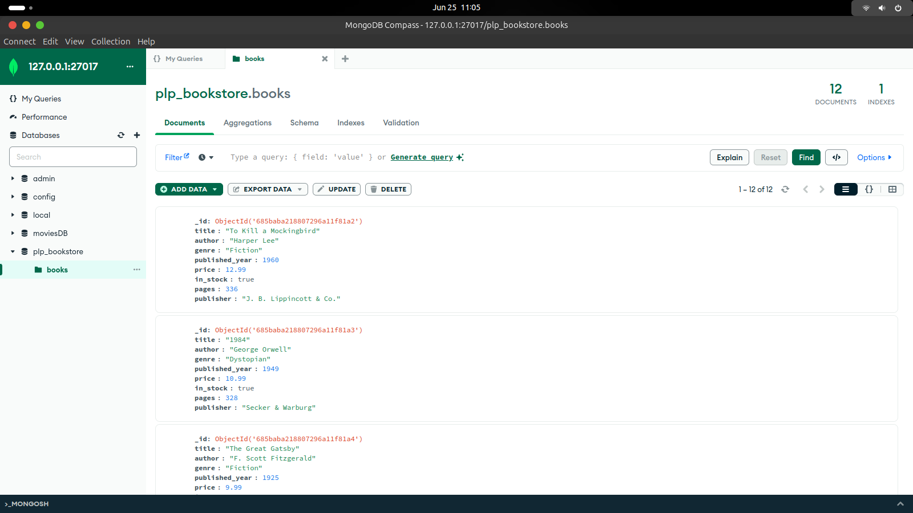

# 📘 Week 1: MongoDB – Data Layer Fundamentals and Advanced Techniques

## 🧠 Objective
This project demonstrates my understanding of MongoDB fundamentals including installation, CRUD operations, advanced queries, aggregation pipelines, and indexing.

## 🛠️ Setup Instructions

### 🔧 Requirements
- Node.js (v22+)
- MongoDB (installed locally or MongoDB Atlas)
- MongoDB Shell (`mongosh`) or MongoDB Compass

## 🚀 How to Run

1.Clone the repository

```bash
git clone https://github.com/PLP-MERN-Stack-Development/week-1-mongodb-fundamentals-assignment-clipperKE.git
cd week-1-mongodb-fundamentals-assignment-clipperKE

2. Install dependencies (if needed)

```bash
npm install mongodb

3. Populate the database

Make sure MongoDB is running locally, then run:
```bash
node insert_books.js
### This will populate the plp_bookstore database with at least 10 book documents.

4. Interact with the database

Open MongoDB Compass:
Connect using: mongodb://127.0.0.1:27017
Open the plp_bookstore database and explore the books collection.

5. 📂 Files Included

File	Description
insert_books.js	Script to insert sample book data into MongoDB
queries.js	All MongoDB queries organized by assignment tasks
screenshot.png	Screenshot of data loaded in my MongoDB Compass
README.md	This file, with setup and usage instructions

6. 📸 Screenshot

Below is a screenshot of the books collection as viewed in my MongoDB Compass:

